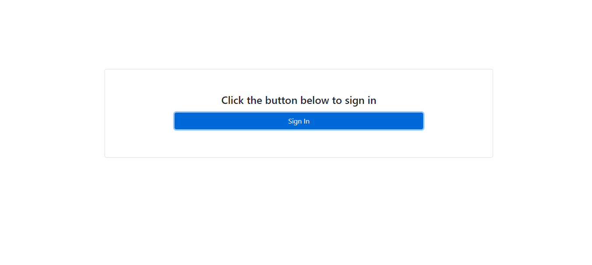
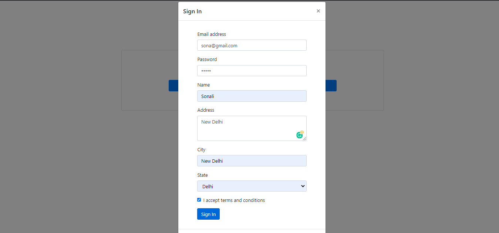

# SimpleSignInForm

An Express application which will generate a HTML form dynamically as per given form template to
take user inputs. The form template and user inputs both will be stored in MongoDB.

Run the project

First we will receive a page in which we will have a Sign In button as shown below:

Once we click Sign In button, we will have a sign in form as a modal shown below:

After filling all the required details as shown:

Click on Sign In button

And after clicking on sign In, we will receive a confirmation message as shown:

